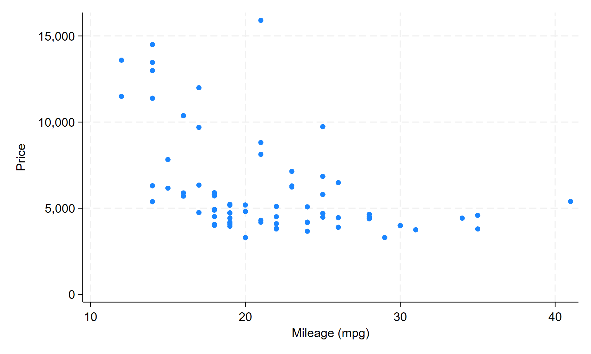

# Output Variant Comparison


```stata
sysuse auto, clear
```


This report summarizes automobile prices and fuel efficiency.


```stata
summarize price mpg
scatter price mpg
graph export "scatter.png", replace
ishere fig using "scatter.png", ///
      title("Figure 1: Price versus fuel efficiency")
```


<figure class="tohtml-figure">

<figcaption class="tohtml-fig-title">Figure 1: Price versus fuel efficiency</figcaption>
</figure>


```stata
regress price mpg* weight
estimates store model1
outreg2e [model1] using "table_regression", replace html
ishere tab using "table_regression.html", ///
      title("Table 1: Regression of price on mpg and weight")
```


<figure class="tohtml-table-block">
<figcaption class="tohtml-table-title">Table 1: Regression of price on mpg and weight</figcaption>
<div class="tohtml-embedded-table">
<div class='texout-table-wrap'>
<table class='texout-table'>
<thead>
<tr>
<th>&nbsp;</th>
<th>(1)</th>
</tr>
<tr>
<th>&nbsp;</th>
<th>model1</th>
</tr>
<tr class='texout-headline'>
<th>VARIABLES</th>
<th>price</th>
</tr>
</thead>
<tbody>
<tr>
<td>mpg</td>
<td class='texout-mono'>-49.51</td>
</tr>
<tr>
<td>&nbsp;</td>
<td class='texout-mono'>(86.16)</td>
</tr>
<tr>
<td>weight</td>
<td class='texout-mono'>1.747***</td>
</tr>
<tr>
<td>&nbsp;</td>
<td class='texout-mono'>(0.641)</td>
</tr>
<tr>
<td>Constant</td>
<td class='texout-mono'>1,946</td>
</tr>
<tr>
<td>&nbsp;</td>
<td class='texout-mono'>(3,597)</td>
</tr>
<tr>
<td>Observations</td>
<td class='texout-mono'>74</td>
</tr>
<tr class='texout-bottomline'>
<td>R-squared</td>
<td class='texout-mono'>0.293</td>
</tr>
<tr class='texout-notes'><td colspan='2'>Standard errors in parentheses</td></tr>
<tr class='texout-notes'><td colspan='2'>*** p&lt;0.01, ** p&lt;0.05, * p&lt;0.1</td></tr>
</tbody>
</table>
</div>
</div>
</figure>


```stata
log close
```


