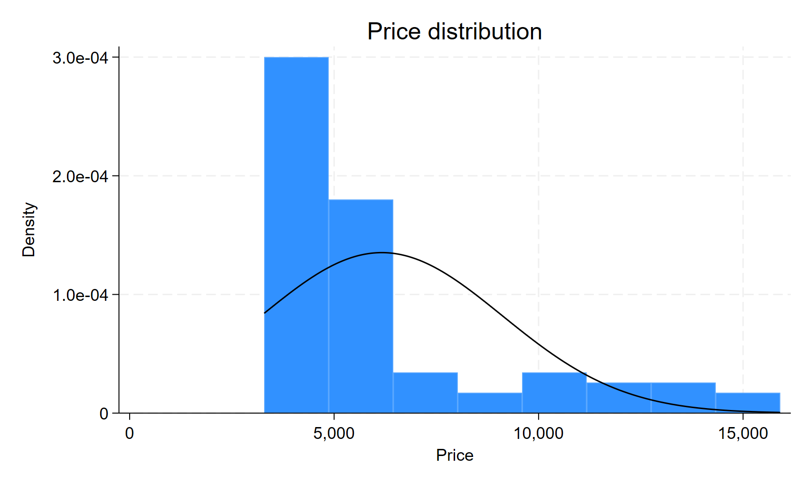
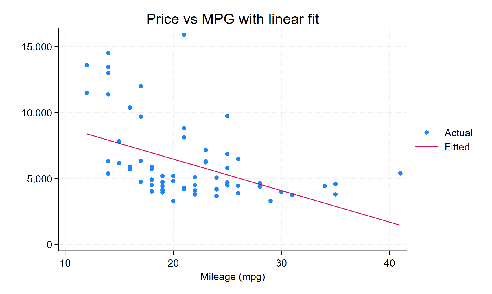

```text
------------------------------------------------------------------------------------------------------------------------
      name:  <unnamed>
       log:  C:/Users/kerry/Desktop/tohtml/Stata_tohtml/tests/example_detail/results/logs/example_detail.log
  log type:  text
 opened on:  23 Aug 2026, 22:32:33
```


# Data Preparation


```stata

. sysuse auto, clear
(1978 automobile data)

. disp "Loaded auto.dta. Observations: `c(N)', Variables: `c(k)'"
Loaded auto.dta. Observations: 74, Variables: 12

. drop if missing(price, mpg, weight, foreign)
(0 observations deleted)

. disp "Dropped missing. Remaining observations: `c(N)'"
Dropped missing. Remaining observations: 74

. gen lprice   = ln(price)

. gen weightkg = weight*0.453592

. label var lprice   "Log of price"

. label var weightkg "Weight (kg)"

. disp "Variables created: lprice, weightkg"
Variables created: lprice, weightkg

```


# Descriptive Statistics


## Table 1


```stata

. table (var) (result), ///
>     statistic(mean  price mpg weight rep78 lprice) ///
>     statistic(sd    price mpg weight rep78 lprice) ///
>     statistic(min   price mpg weight rep78 lprice) ///
>     statistic(max   price mpg weight rep78 lprice) ///
>     nototals ///
>     export($results/summary.html, replace)

-----------------------------------------------------------------------------------
                   |      Mean   Standard deviation   Minimum value   Maximum value
-------------------+---------------------------------------------------------------
Price              |  6165.257             2949.496            3291           15906
Mileage (mpg)      |   21.2973             5.785503              12              41
Weight (lbs.)      |  3019.459             777.1936            1760            4840
Repair record 1978 |  3.405797             .9899323               1               5
Log of price       |  8.640633             .3921059        8.098947        9.674452
-----------------------------------------------------------------------------------
(collection Table exported to file
 C:/Users/kerry/Desktop/tohtml/Stata_tohtml/tests/example_detail/results/summary.html)

. ishere tab using "$results/summary.html"

```


<iframe src='./tables/summary.html' width='100%' height='256px' frameBorder='0' scrolling='auto' onload="this.style.height=this.contentDocument.documentElement.scrollHeight+'px';"></iframe>


# Figures


## Figure 1


```stata

. histogram price, normal title("Price distribution")
(bin=8, start=3291, width=1576.875)

. graph export "$figures/price_hist.png", replace
file C:/Users/kerry/Desktop/tohtml/Stata_tohtml/tests/example_detail/results/figures/price_hist.png saved as PNG
    format

. ishere fig using "$figures/price_hist.png"

```





## Figure 2


```stata

. twoway (scatter price mpg) (lfit price mpg), ///
>     title("Price vs MPG with linear fit") legend(order(1 "Actual" 2 "Fitted"))

. graph export "$figures/price_mpg.png", replace
file C:/Users/kerry/Desktop/tohtml/Stata_tohtml/tests/example_detail/results/figures/price_mpg.png saved as PNG format

. ishere fig using "$figures/price_mpg.png"

```





this is a paragraph of text

this is another paragraph of text

this is a third paragraph of text

this is a mathematical expression

$$y = \beta_0 + \beta_1 x_1 + \beta_2 x_2 + \epsilon$$

the picture is pretty


# Regression


## Narrative Example


```stata

. regress price mpg weight

      Source |       SS           df       MS      Number of obs   =        74
-------------+----------------------------------   F(2, 71)        =     14.74
       Model |   186321280         2  93160639.9   Prob > F        =    0.0000
    Residual |   448744116        71  6320339.67   R-squared       =    0.2934
-------------+----------------------------------   Adj R-squared   =    0.2735
       Total |   635065396        73  8699525.97   Root MSE        =      2514

------------------------------------------------------------------------------
       price | Coefficient  Std. err.      t    P>|t|     [95% conf. interval]
-------------+----------------------------------------------------------------
         mpg |  -49.51222   86.15604    -0.57   0.567    -221.3025     122.278
      weight |   1.746559   .6413538     2.72   0.008      .467736    3.025382
       _cons |   1946.069    3597.05     0.54   0.590    -5226.245    9118.382
------------------------------------------------------------------------------

. local r2 = e(r2)

. display %5.3f `r2'
0.293

. ishere display %5.3f `r2'
0.293

```


The R-squared is  0.293 .


```stata

. qui regress price mpg weight i.foreign, vce(robust)

. estimates store model1

. qui regress price mpg , vce(robust)

. estimates store model2

. qui regress price i.foreign, vce(robust)

. estimates store model3

. qui regress price mpg weight i.foreign, vce(robust)

. estimates store model4

. qui regress price mpg weight i.foreign, vce(robust)

. estimates store model5

. qui regress price mpg weight i.foreign, vce(robust)

. estimates store model6

. qui regress price mpg weight i.foreign, vce(robust)

. estimates store model7

. qui regress price mpg weight i.foreign, vce(robust)

. estimates store model8

. qui regress price mpg weight i.foreign, vce(robust)

. estimates store model9

. qui regress price mpg weight i.foreign, vce(robust)

. estimates store model10

. qui regress price mpg weight i.foreign, vce(robust)

. estimates store model11

. qui regress price mpg weight i.foreign, vce(robust)

. estimates store model12

. qui regress price mpg weight i.foreign, vce(robust)

. estimates store model13

```


## Table 2


```stata

. outreg2e [model1 model2 model3 model4 model5] using "$results/model.html", replace html
C:/Users/kerry/Desktop/tohtml/Stata_tohtml/tests/example_detail/results/model.html
C:/Users/kerry/Desktop/tohtml/Stata_tohtml/tests/example_detail/results/model.md
dir : seeout

. ishere tab using "$results/model.html"

```


<iframe src='./tables/model.html' width='100%' height='562px' frameBorder='0' scrolling='auto' onload="this.style.height=this.contentDocument.documentElement.scrollHeight+'px';"></iframe>


## Table 3


```stata

. outreg2e [model*] using "$results/model2.html", replace html
C:/Users/kerry/Desktop/tohtml/Stata_tohtml/tests/example_detail/results/model2.html
C:/Users/kerry/Desktop/tohtml/Stata_tohtml/tests/example_detail/results/model2.md
dir : seeout

. ishere tab using "$results/model2.html"

```


<iframe src='./tables/model2.html' width='100%' height='562px' frameBorder='0' scrolling='auto' onload="this.style.height=this.contentDocument.documentElement.scrollHeight+'px';"></iframe>


